# 🧠 Finance AI Tracker

A Full-Stack FinTech application that integrates AI (OpenAI gpt-4o-mini) to help users upload, parse, and analyze their bank statements. It provides automated insights, reports, and summaries to track financial health.

## Live Demo

https://github.com/user-attachments/assets/936eb0c3-77ed-4ab0-b0de-2bfa7e46b9e2

This document outlines the architecture and data flow of the Finance AI Tracker application, which consists of a React-based frontend and a Node.js/Express backend.
Got it 🚀 — here’s a **concise version** of your Finance AI Tracker docs:

## 1. Frontend

- **React + react-router-dom** → Navigation & routing
- **AuthContext** → Authentication state (JWT in `localStorage`)
- **Axios** → API calls with JWT interceptor
- **Tailwind CSS** → Styling
- **Recharts** → Charts & reports
- **Key Pages**: `Login`, `Register`, `Dashboard`, `Upload`, `Report`, `Settings`
- **Core Components**: `ProtectedRoute`, `Layout`, `TransactionsTable`, `ExpensesChart`, `UploadArea`

## 2. Backend

- **Node.js + Express** → REST APIs
- **MongoDB + Mongoose** → Data persistence
- **Auth (JWT)** → Secure routes
- **Multer** → File uploads
- **OpenAI (gpt-4o-mini)** → Transaction parsing & financial insights

## 3. Core Flows

### 🔑 Authentication

1. User logs in/registers (Frontend → API).
2. Backend verifies creds, issues JWT.
3. Frontend stores JWT (`AuthContext`) & updates state.

### 📂 Statement Upload + AI Processing

1. User uploads PDF/CSV/TXT.
2. Backend: Multer saves → Extracts text → AI parses → Validates + saves in MongoDB.
3. AI generates insights (summaries + Hinglish advice).
4. Frontend displays transactions & insights.

### 📈 Transactions & Reports

- CRUD ops on transactions.
- Dashboard: Income, Expenses, Category breakdown.
- Export CSV reports.

---

### Thanks..Keep learning
